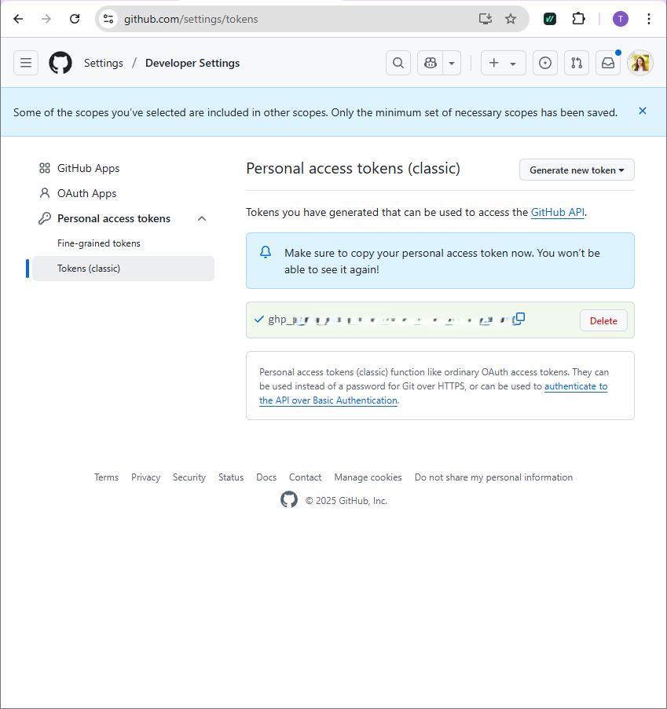
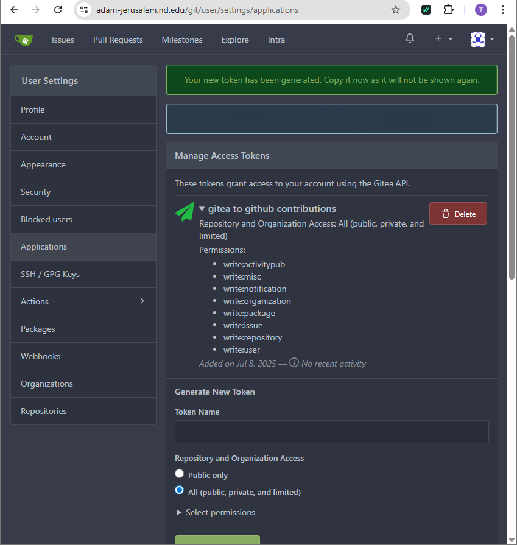

# Gitea to GitHub Mirror Script

This repository contains platform-specific scripts to automate the process of mirroring **all** repositories from a Gitea instance to GitHub.

## Features

- Automatically fetches all repositories for a given Gitea user
- Creates corresponding private repositories on GitHub (can be changed to public)
- Mirrors all repositories, preserving all branches, tags, and commit history
- Platform-specific versions for Windows, Linux, and macOS
- Automatic dependency checking and helpful error messages

## Platform-Specific Scripts

Choose the script that matches your operating system:

- **Windows**: `gitea_to_github_mirror.ps1` (PowerShell script, recommended)
- **Windows (Alternative)**: `gitea_to_github_mirror.bat` (Batch file, limited functionality)
- **Windows (Bash)**: `gitea_to_github_mirror_windows.sh` (Original bash script - works with Git Bash/WSL)
- **Linux**: `gitea_to_github_mirror_linux.sh` (Bash script)
- **macOS**: `gitea_to_github_mirror_macos.sh` (Bash script)

## Prerequisites

### Windows

- PowerShell 5.1 or later (Windows 10+)
- Git for Windows installed
- No additional tools required (PowerShell handles HTTP requests natively)

### Linux

- `jq` (JSON processor)
- `curl` (HTTP client)
- `git` (version control)

### macOS

- `jq` (JSON processor)
- `curl` (HTTP client)
- `git` (version control)
- Homebrew (recommended for easy installation)

## Installation & Setup

### Windows Setup

1. **Install Git for Windows:**
   - Download from: <https://git-scm.com/download/win>
   - Install with default settings

2. **Choose your script:**
   - **Recommended**: Use `gitea_to_github_mirror.ps1` (PowerShell) for full functionality
   - **Bash**: Use `gitea_to_github_mirror_windows.sh` (Bash file) for full functionality if using Git Bash/WSL terminals
   - **Alternative**: Use `gitea_to_github_mirror.bat` (Batch file) for basic functionality

3. **For PowerShell (Recommended):**
   - Verify PowerShell: Open PowerShell as Administrator
   - Check version: `$PSVersionTable.PSVersion`
   - Configure Git (if not already done):

   ```powershell
   git config --global user.name "Your Name"
   git config --global user.email "your.email@example.com"
   ```

4. **For Batch File:**
   - No additional setup required
   - Limited functionality compared to PowerShell version

5. **For Bash Script (Git Bash/WSL):**
   - Install Git for Windows (includes Git Bash)
   - Or use Windows Subsystem for Linux (WSL)
   - Install required tools: `jq`, `curl`, `git`
   - Full functionality with bash environment

### Linux Setup

#### Ubuntu/Debian

```bash
sudo apt-get update
sudo apt-get install jq curl git
```

#### CentOS/RHEL

```bash
sudo yum install jq curl git
```

#### Fedora

```bash
sudo dnf install jq curl git
```

#### Arch Linux

```bash
sudo pacman -S jq curl git
```

### macOS Setup

#### Using Homebrew (Recommended)

```bash
# Install Homebrew if not already installed
/bin/bash -c "$(curl -fsSL https://raw.githubusercontent.com/Homebrew/install/HEAD/install.sh)"

# Install required packages
brew install jq curl git
```

#### Manual Installation

- Download `jq` from: <https://stedolan.github.io/jq/download/>
- `curl` and `git` are usually pre-installed on macOS

## Usage

### Set the same email on GitHub

Make sure the email used in your Gitea commits is added to your GitHub account under Settings > Emails.

### 1. Configure the Script

Edit the configuration section at the top of your chosen script:

- `GITEA_USER`: Your Gitea username
- `GITEA_URL`: Base URL of your Gitea instance (e.g., `https://yourdomain.com/git`)
- `GITEA_DOMAIN`: Domain of your Gitea instance (e.g., `yourdomain.com`)
- `GITHUB_USER`: Your GitHub username
- `GITHUB_TOKEN`: Your GitHub Personal Access Token (PAT)
- `GITEA_TOKEN`: Your Gitea API token

### 2. Run the Script

#### Windows (PowerShell - Recommended)

```powershell
# Open PowerShell as Administrator
# Navigate to script directory
cd "C:\path\to\gitea-to-github"

# Set execution policy (if needed)
Set-ExecutionPolicy -ExecutionPolicy RemoteSigned -Scope CurrentUser

# Run the script
.\gitea_to_github_mirror.ps1
```

#### Windows (Batch File - Alternative)

```cmd
# Open Command Prompt
# Navigate to script directory
cd "C:\path\to\gitea-to-github"

# Run the script
gitea_to_github_mirror.bat
```

#### Windows (Bash Script - Git Bash/WSL)

```bash
# Open Git Bash or WSL terminal
# Navigate to script directory
cd /c/path/to/gitea-to-github

# Make script executable
chmod +x full_gitea_to_github_mirror.sh

# Run the script
./full_gitea_to_github_mirror.sh
```

---

#### Linux

```bash
# Make script executable
chmod +x gitea_to_github_mirror_linux.sh

# Run the script
./gitea_to_github_mirror_linux.sh
```

#### macOS

```bash
# Make script executable
chmod +x gitea_to_github_mirror_macos.sh

# Run the script
./gitea_to_github_mirror_macos.sh
```

---

## How to Get Your Tokens

### GitHub Personal Access Token (PAT)

1. Go to [GitHub Settings > Developer settings > Personal access tokens](https://github.com/settings/tokens)
2. Click "Generate new token (classic)"
3. Name it something like gitea-sync-token.
4. Select the required scopes
   - ✅ repo → for pushing to repos
   - ✅ admin:repo_hook → for repo creation
5. Set an expiration if you want (e.g. 90 days).
6. Click "Generate token".
7. Copy and save the generated token (you won't be able to see it again)



### Gitea API Token

1. Log in to your Gitea account in your browser.
2. Go to "Settings" > "Applications"
3. Under "Manage Access Tokens", click "Generate Token"
4. Enter a name for your token (e.g. github-mirror).
5. Select the scopes/permissions:
   - ✅ repo
   - ✅ write:repo_hook
   - ✅ admin:repo_hook
   - ✅ or simply choose "all" to make it simple.
6. Click "Generate Token"
7. Copy and save the generated token - you will never see it again!



## Troubleshooting

### Common Issues

#### Windows

- **Execution Policy Error**: Run `Set-ExecutionPolicy -ExecutionPolicy RemoteSigned -Scope CurrentUser`
- **Git not found**: Ensure Git for Windows is installed and added to PATH

#### Linux

- **Permission Denied**: Run `chmod +x script_name.sh`
- **Package not found**: Use the appropriate package manager for your distribution

#### macOS

- **Permission Denied**: Run `chmod +x script_name.sh`
- **Homebrew not found**: Install Homebrew first, then install packages

### Error Messages

- **"jq not found"**: Install jq using your platform's package manager
- **"curl not found"**: Install curl using your platform's package manager
- **"git not found"**: Install git using your platform's package manager
- **"Authentication failed"**: Check your tokens and ensure they have correct permissions

## Notes

- The scripts create private repositories on GitHub by default. To create public repositories, change `"private":true` to `"private":false` in the script.
- Make sure your tokens have sufficient permissions to read from Gitea and create/push to GitHub repositories.
- The scripts automatically clean up local clone files after pushing to GitHub to save disk space.
- All scripts include error handling and will continue processing other repositories if one fails.

## Platform Differences

| Feature | Windows (PowerShell) | Windows (Batch) | Windows (Bash) | Linux | macOS |
|---------|---------------------|-----------------|----------------|-------|-------|
| Script Type | PowerShell (.ps1) | Batch (.bat) | Bash (.sh) | Bash (.sh) | Bash (.sh) |
| HTTP Requests | Invoke-RestMethod | Manual/curl | curl | curl | curl |
| JSON Processing | PowerShell native | Manual parsing | jq | jq | jq |
| Package Manager | Chocolatey/Winget | Manual install | apt/yum/dnf/pacman | apt/yum/dnf/pacman | Homebrew |
| File Operations | Remove-Item | rmdir | rm | rm | rm |
| Error Handling | try-catch | if/errorlevel | exit codes | exit codes | exit codes |
| Auto-repo Detection |  Yes |  No |  Yes |  Yes |  Yes |
